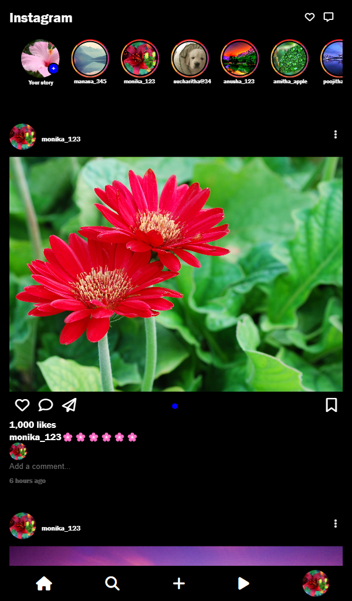
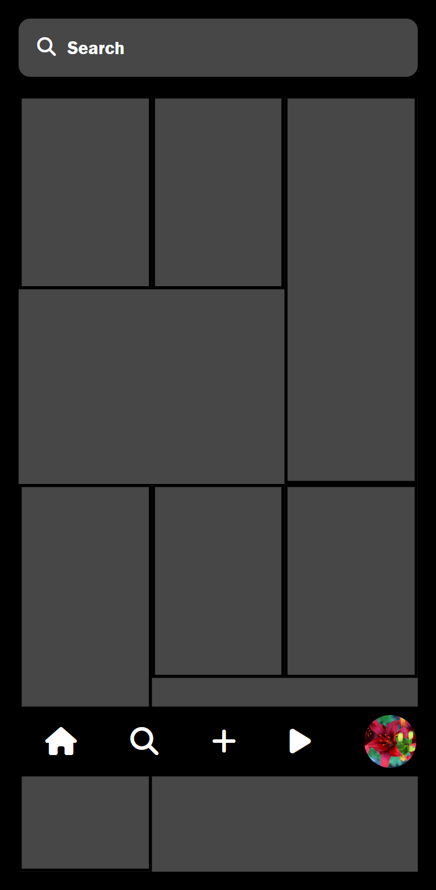
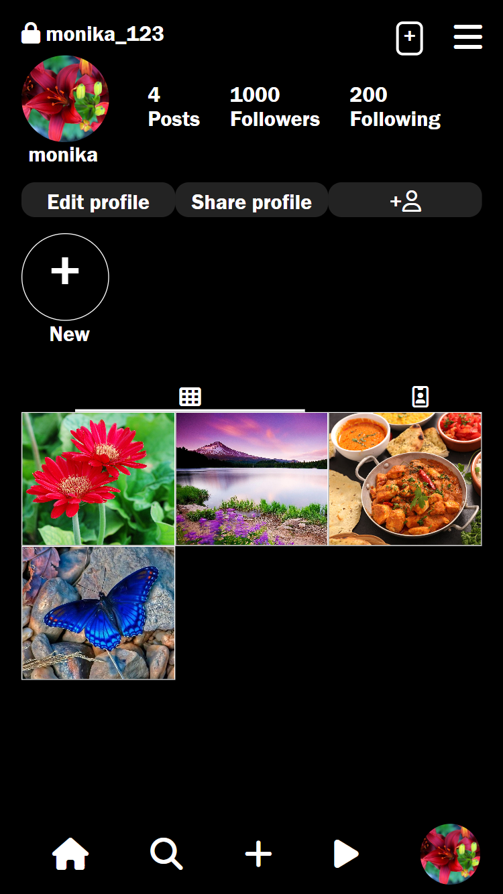

<h1>Instagram clone</h1>

This project is a clone of the Instagram UI. I made it to study and improve my skills with HTML and CSS, and learn new concepts, like layouts, responsiveness, positioning and some JS concepts. Any feedback, opinions or suggestions is very welcome!

This instagram clone is created for mobile responsive ness 

